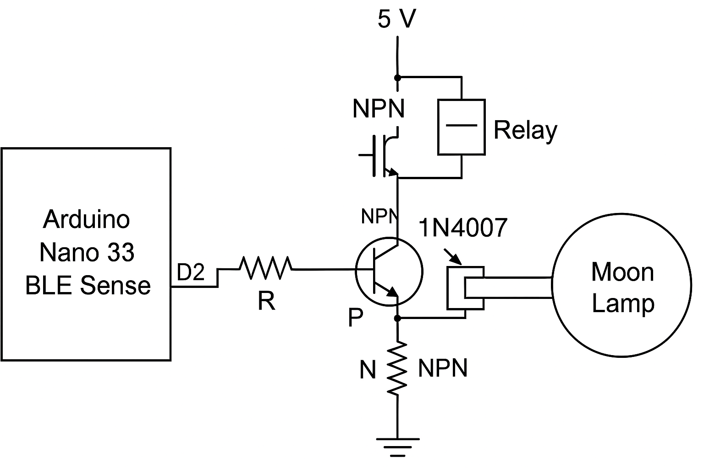

# 🌕 Embedded Speech Command Recognition for Moon Lamp Switching  
**CASA0018 Final Project — Yue Zhu**

## 1. Project Overview

This project aims to develop an embedded system that enables a Moon Lamp to be switched on and off using voice commands. The system leverages an Arduino Nano 33 BLE Sense and a speech recognition model trained on the Edge Impulse platform.  
The motivation stems from the need for contactless, accessible lighting control solutions, especially for individuals with mobility impairments or those seeking greater convenience in home environments.

## 2. Problem Definition and Motivation

Traditional lighting systems often require physical interaction, which can be inconvenient or inaccessible for elderly users, people with disabilities, or during nighttime scenarios.  
By enabling voice control using lightweight, embedded machine learning models, this project demonstrates a more natural and user-friendly way to interact with smart home devices, while addressing challenges such as device resource constraints, noise robustness, and low-latency responses.

## 3. System Design

### Hardware
- Arduino Nano 33 BLE Sense
- 5V Relay Module
- NPN Transistor
- 1N4007 Protection Diode
- USB-powered Moon Lamp
- Basic Breadboard and Jumper Wires

The Arduino's 3.3V output controls a 5V relay using a transistor amplification circuit. A diode is placed across the relay coil to protect the circuit from voltage spikes.

### Software and Model
- Data Acquisition and Model Training: Edge Impulse Studio
- Input Features: MFCC (Mel-Frequency Cepstral Coefficients)
- Model Architecture: 1D Convolutional Neural Network (CNN)
- Deployment: Quantized (int8) model exported as Arduino C++ library

The Arduino device runs the model locally and continuously listens for "on" and "off" commands to switch the lamp.

## 4. Data Collection and Model Training

- **Data Volume**: ~400 audio samples (commands: "on", "off", and environmental noise)
- **Participants**: 20+ speakers with diverse accents and recording conditions
- **Feature Extraction**: 13 MFCC coefficients with 16 kHz sampling rate
- **Training Configuration**:
  - 97 epochs
  - Cross-entropy loss
  - Learning rate: 0.005
  - Data augmentation: background noise injection, time-frequency masking

Final model achieved:
- **Validation Accuracy**: 91.8%
- **Test Set Accuracy**: 87.65%
- **AUC**: 0.97

## 5. Experimental Results

Testing was conducted across three environmental conditions:

| Environment         | Recognition Accuracy |
|----------------------|-----------------------|
| Quiet (indoor)        | 96.5%                 |
| Medium noise (fan/conversation) | 89%        |
| High noise (TV/music) | 78%                   |

- **Observations**:
  - The system performs well in typical home environments.
  - Sensitivity decreases under heavy background noise or unclear pronunciation.
  - Female voices showed slightly better recognition, likely due to overlap with training sample characteristics.

## 6. Critical Reflection and Lessons Learned

- **Data diversity**: Including more diverse background noise and accent variations significantly improves model robustness.
- **Edge Constraints**: Quantization is crucial to reduce model size and inference delay (average inference time: 266 ms).
- **Environmental robustness**: The system is sensitive to loud background noises; future improvements could involve multi-keyword systems and denoising strategies.
- **User interaction**: Adding feedback LEDs or sound alerts could improve user experience.

**Future Work**:
- Upgrade to Arduino Nano 33 BLE Sense Rev2 for better processing performance.
- Extend the command set to include "dim", "brighten", etc.
- Support for multilingual voice commands.
